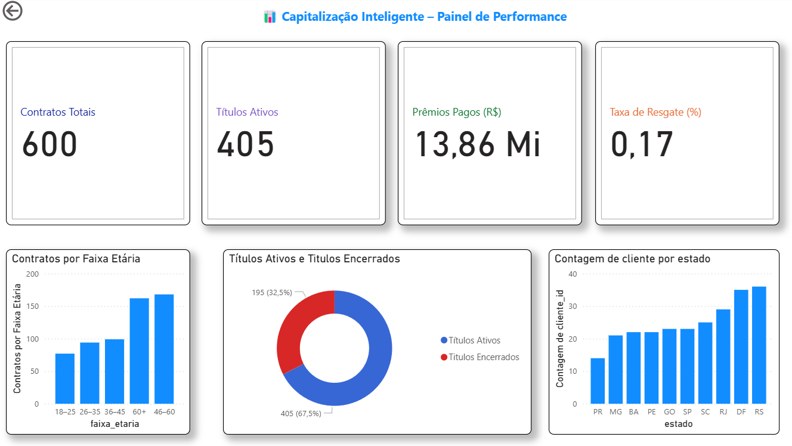

# Capitalização Inteligente – DataFlow Analytics

Automação de ingestão, modelagem e análise para dados de capitalização.  
Stack: **Python**, **Docker**, **PostgreSQL** e **Power BI**.

---

## 🎯 Objetivos
- Centralizar dados em PostgreSQL (Docker).
- Padronizar extração/transformação (Python/SQL).
- Entregar métricas e visuais executivos no Power BI.
- Documentar e versionar com segurança (.env, .gitignore, dados sensíveis fora do repo).

---

## 🏗️ Arquitetura do Projeto

```
/bi
  powerbi_dax_measures.md  # medidas DAX para Power BI

/data
  /raw                     # dados brutos (IGNORADOS no git)
  /staging                 # dados intermediários (IGNORADOS)

/sql
  database_schema.sql      # definição de tabelas e views

/src
  api_bcb.py               # integração com dados do Banco Central
  etl_capitalizacao.py     # pipeline ETL principal
  gerar_dados_fake.py      # geração de dados fictícios para testes
  gerar_relatorio.py       # exportação de relatórios em PDF/BI
  utils_db.py              # funções utilitárias para conexão ao banco
  carregamentos_dados.py   # orquestra ingestões de dados

.env                       # variáveis de ambiente (IGNORADO no git)
.env.example               # exemplo de configuração de variáveis
.gitignore                 # arquivos e pastas ignorados pelo git
docker-compose.yml         # orquestração de containers (PostgreSQL + pgAdmin)
requirements.txt           # dependências Python
README.md                  # documentação principal do projeto
```
---

## 🔐 Variáveis de ambiente

Crie um arquivo `.env` (não versionado / env ficticio) com as variáveis abaixo:
```
PG_HOST=localhost
PG_PORT=5432
PG_DB=brasilcap
PG_USER=cda_user
PG_PASSWORD=cda_pass
```
⚠️ Atenção:
Este é apenas um exemplo fictício, usado para fins de demonstração do projeto.
Nenhuma credencial real é utilizada.
O arquivo .env não deve ser versionado (ele já está listado no .gitignore).
Em um ambiente real, substitua esses valores por variáveis seguras e configure-as diretamente no servidor ou container.

---

## 🐳 Subindo com Docker

1) Suba o banco e o pgAdmin:

```bash
docker compose up -d
docker ps
```

2) Acesse o pgAdmin (porta configurada no `docker-compose.yml`) e registre o servidor com as credenciais do `.env`.

---

## 🗄️ Provisionamento do Banco

Execute os scripts de schema e objetos:

```bash
# exemplo
psql -h $PG_HOST -U $PG_USER -d $PG_DB -f sql/database_schema.sql
```

---

## 🔁 ETL com Python

### Pré-requisitos
- Python 3.11+
- (Opcional) pyenv/Poetry

### Instalação local
```bash
python -m venv .venv
source .venv/bin/activate
pip install -r requirements.txt
```

### Executando ingestão e transformações
```bash
python src/etl_capitalizacao.py
```

---

## 📊 Power BI

1) Abra o arquivo do relatório (modelo `.pbit`) em **bi/powerbi_dax_measures.md** como referência de medidas.  
2) Configure a conexão:
   - **Servidor**: `localhost,5432`  
   - **Banco**: `brasilcap`


## 📈 Dashboard



---

## 🧹 Git Hygiene

- `.gitignore` cobre: `.env`, dados `data/*`, binários (`.pbix`, `.xlsx`, `.accdb`), caches/venvs e volumes do Docker.
- Nunca comite credenciais ou dados reais. Use amostras fictícias em `/data/sample/`.

---

## 📦 Scripts úteis

```bash
# Subir/derrubar stack
docker compose up -d
docker compose down -v

# Popular tabelas com CSV fictício
python src/gerar_dados_fake.py

# Gerar relatório consolidado
python src/gerar_relatorio.py
```

---

## 📄 Licença
MIT